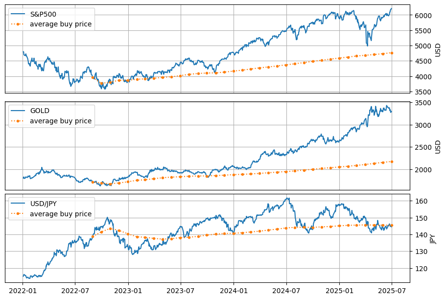

このページは、はてな匿名ダイアリーへの投稿 "[増田の事後検証（長期投資編）](https://anond.hatelabo.jp/20220830191713)" に関するページです。

S&P500とゴールドを毎月1万円ずつ積立てした場合の損益を記録しています。

# 現在の損益
S&P500とゴールドの現在の合計損益は `+32.7%(+143,802円)` です。

これは、2022年8月末から積立てを開始し、2024年05月31日現在までの22ヵ月間の損益です。

- 銘柄別の損益

| 銘柄 | 投入資金 | 評価額 | 収益額 | 収益率 | 年率換算 |
| --- | ---: | ---: | ---: | ---: | ---: |
| S&P500 | 220,000円 | 293,832円 | +73,832円 | +33.6% | +17.1% |
| GOLD | 220,000円 | 289,970円 | +69,970円 | +31.8% | +16.3% |
| 合計 | 440,000円 | 583,802円 | +143,802円 | +32.7% | +16.7% |

## 収益推移
以下は各時点の損益をグラフにしたものです。上側のグラフが収益額(円)、下側のグラフが収益率(%)です。

## 価格推移
以下は2022年1月からの S&P500, ゴールド, ドル円 の価格チャートです。
オレンジの点線は積立の平均取得単価を表しています。（平均取得単価の始点は、積立て開始日の2022年8月31日）

現在価格が平均取得単価より上であれば収益はプラス、平均取得価格より下であれば収益はマイナスになります。

## 補足
- 収益の計算方法
  - S&P500とゴールドを月末に1万円ずつ購入する
  - 日本円をそのときの為替でドルに両替してから購入する
  - 手数料は考慮しない（データが取得できそうであれば対応する）
  - 配当は考慮しない（データが取得できそうであれば対応する）

- 購入価格の明細
  - 積立損益計算.ipynb に記載
